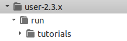
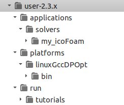

# OpenFOAMのカスタマイズ・ソースコード改造 超入門 #

## 目的 ##

今回の講習の目的は，OpenFOAMをカスタマイズ（ソースコードを変更する）ための手順の全体像を学ぶことである。時間に制約があるため，ソースコードの詳細には触れない。

## 手順 ##

1.   ベースとなるコードの選定
2.   ベースコードをユーザ作業ディレクトリに複製
3.   ベースコードの例題ディレクトリをユーザ実行ディレクトリに複製（名前の変更作業）
4.   ベースコードがコンパイルできることを確認する
5.   コンパイルしたベースコードが実行できることを確認する
6.   コードの変更
7.   コンパイル
8.   例題の変更
9.   実行   

## 実作業 ##

### 1. ベースとなるコードの選定 ###

OpenFOAMからオリジナルコードを作成する時には，既存のコードから目的に近いモノを選び，修正していくことを推奨する。

今回は，非定常，非圧縮，層流を解くicoFoamをベースとする。これに，温度場を求めるためのエネルギー方程式を追加する。ただし，温度場と速度場とは連成しないものとする。

温度場の式

### 2. ベースコードをユーザ作業ディレクトリに複製 ###

使用しているOpenFOAMの環境を確認する。OpenFOAMのインストールされているディレクトリを下記コマンドを実行して確認する。

    コマンド	echo $WM_PROJECT_DIR
    実行結果	/home/user/OpenFOAM/OpenFOAM-2.3.x

インストールしたOpenFOAMのソースコードは，`$WM_PROJECT_DIR/applications/solvers` に保存されている。このディレクトリは，`$FOAM_SOLVERS` 変数に格納されている。

ユーザーがソースコードを格納したり，例題を実行したりするディレクトリは，各ユーザーのホームディレクトリ内に作ることが推奨されている。ユーザーのプロジェクトディレクトリ内に，目的ごとにディレクトリを作成する。
ユーザーのプロジェクトディレクトリは， `$WM_PROJECT_USER_DIR` に格納されている。

下記コマンドを実行して，ユーザーのプロジェクトディレクトリを確認する。

    コマンド	echo $WM_PROJECT_USER_DIR
    実行結果	/home/user/OpenFOAM/user-2.3.x

実行前のディレクトリ構造。実行用ディレクトリ run だけが存在する。

一般的には，カスタマイズしたソルバは， `$WM_PROJECT_USER_DIR/applications/solvers` に保存する。

OpenFOAMインストール時の実行ファイルは，`$FOAM_APPBIN` ディレクトリに格納されている。

    コマンド	echo $FOAM_APPBIN
    実行結果	/home/user/OpenFOAM/OpenFOAM-2.3.x/platforms/linuxGccDPOpt/bin

本当に？確かめよう。icoFoamがどこにあるかは，次のコマンド（`which`）で確認できる。

    コマンド	which icoFoam
    実行結果	/home/user/OpenFOAM/OpenFOAM-2.3.x/platforms/linuxGccDPOpt/bin/icoFoam

コンパイルに成功すると生成される実行ファイルは，`$FOAM_USER_APPBIN` に格納する。

    コマンド	echo $FOAM_USER_APPBIN
    実行結果	/home/user/OpenFOAM/user-2.3.x/platforms/linuxGccDPOpt/bin

ユーザのソルバ・ソースコード・ディレクトリ（`$WM_PROJECT_USER_DIR/applications/solvers`）を作成する。

    mkdir -p $WM_PROJECT_USER_DIR/applications/solvers

> ファイルマネージャーで操作する場合
> 
> $WM_PROJECT_USER_DIR を開く。
> 
> 新しいディレクトリを作成して，applications という名前にする。
> 
> applicationsディレクトリの中に入る。
> 
> 新しいディレクトリを作成して，solvers という名前にする。

ユーザのソルバ・ソースコード・ディレクトリ（`$WM_PROJECT_USER_DIR/applications/solvers`）に，システムのソースコード・ディレクトリ（`$FOAM_SOLVERS/incompressible/`）から，icoFoamディレクトリをコピーする。コピーしたディレクトリは， *my_icoFoam* という名前にする。

    cp -r $FOAM_SOLVERS/incompressible/icoFoam $WM_PROJECT_USER_DIR/applications/solvers/my_icoFoam

> ファイルマネージャーで操作する場合
> 
> $FOAM_SOLVERS/incompressible/ を開く。
> 
> icoFoamディレクトリをコピーする。
> 
> $WM_PROJECT_USER_DIR/applications/solvers を開く。
> 
> コピーしたicoFoamディレクトリを貼付け，名前をmy_icoFoamに変更する。
> 

### 3. ベースコードの例題ディレクトリをユーザ実行ディレクトリに複製（名前の変更作業） ###

my_icoFoam ディレクトリへ移動する

    cd $WM_PROJECT_USER_DIR/applications/solvers/my_icoFoam

icoFoam.Cファイルの名前をmy_icoFoam.Cに変更する

    mv icoFoam.C my_icoFoam.C

不要なファイル（icoFoamコンパイル時に生成されていたもの）を削除する

    rm icoFoam.dep

Make subdirectory の 'files' file を修正する。エディタを起動し，`$WM_PROJECT_USER_DIR/applications/solvers/my_icoFoam/Make/files` ファイルを開く。その内容を，下記の通りに書き換える。書き換えが終われば，保存してエディタを終了する。

    my_icoFoam.C
    EXE = $(FOAM_USER_APPBIN)/my_icoFoam

このfilesファイルでは，コンパイルするファイル名と，コンパイルした後の保存先とファイル名を指定している。保存先がユーザーの実行ファイルディレクトリになっていることに注意する。

不要なディレクトリを削除する（icoFoamコンパイル時に生成されていたもの）

    rm -rf Make/linuxGccDP0pt

> ファイルマネージャーで操作する場合
> 
> $WM_PROJECT_USER_DIR/applications/solvers/my_icoFoamディレクトリを開く。
> 
> icoFoam.Cファイルの名前を，my_icoFoam.C に変更する。
> 
> 不要なファイル icoFoam.dep を削除する。
> 
> Makeディレクトリに入る。
> 
> files ファイルをダブルクリックして開く。その中身を下記の様に修正して，保存する。
> 
> >    my_icoFoam.C
> 
> >    EXE = $(FOAM_USER_APPBIN)/my_icoFoam
> 
> Makeディレクトリ内にあるlinuxGccDP0pt ディレクトリを削除する。

### 4. ベースコードがコンパイルできることを確認する ###

my_icoFoam ディレクトリへ移動する。（先ほどと同じ場所）

    cd $WM_PROJECT_USER_DIR/applications/solvers/my_icoFoam

下記のコマンドを実行して，ソースコードをコンパイルする。

    wmake

### 5. コンパイルしたベースコードが実行できることを確認する ###

実行ファイルができたことを確認する．

    ls $FOAM_USER_APPBIN

実行後のディレクトリ構造。ソルバ用，実行形式ファイル用，実行用ディレクトリが存在する。

### 6. コードの変更 ###

createField.H に，DT と T を追加する。

    Info<< "Reading transportProperties\n" << endl;

    IOdictionary transportProperties
    (
        IOobject
        (
            "transportProperties",
            runTime.constant(),
            mesh,
            IOobject::MUST_READ,
            IOobject::NO_WRITE
        )
    );
    
    dimensionedScalar nu
    (
         transportProperties.lookup("nu")
    );
    //Add here...
    dimensionedScalar DT
    (
         transportProperties.lookup("DT")
    );
    //Done for now...

    Info<< "Reading field T\n" <<endl;
    volScalarField T
    (
        IOobject
        (
             "T",
             runTime.timeName(),
             mesh,
             IOobject::MUST_READ,
             IOobject::AUTO_WRITE
         ),
         mesh
    );

my_icoFoam.C に，温度場の式を追加。
    
                 U -= rUA*fvc::grad(p);
                 U.correctBoundaryConditions();
            }
                
    //add these lines...
            fvScalarMatrix TEqn
            (
                fvm::ddt(T)
                + fvm::div(phi, T)
                - fvm::laplacian(DT, T)
            );

            TEqn.solve();
    //done adding lines...
    
            runTime.write();

### 7. コンパイル ###

    cd $WM_PROJECT_USER_DIR/applications/solvers/my_icoFoam

    wmake

### 8. 例題の変更 ###

constant/transportProperties に，DTを追加。（nuを参考に）

    DT            DT [0 2 -1 0 0 0 0] 0.002;

0/ ディレクトリに，T ファイルを追加。（pを参考に）内容は下記の通り。

       class           volScalarField;
        object          T;
    }
    //**********************************//
    
    dimensions       [0 0 0 1 0 0 0];
    
    internalField    uniform 300;
    
    boundaryField
    {
        movingWall
        {
            type        fixedValue;
            value       uniform 350;
        }

        fixedWalls
        {
            type        fixedValue;
            value       uniform 300;
        }

        frontAndBack
        {
            type        empty;
        }
    }

system/fvSchemes ファイルに，温度場の解き方に関する設定を追加。OpenFOAMのバージョンが2.2以前の場合には，下記に加えてlaplacianSchemes にも追加が必要である。Uの場合と同様とすればよい。

    divSchemes
    {
        default         none;
        div(phi,U)      Gauss linear;
        div(phi,T)      Gauss upwind; //NOTICE: there is no space between the comma and the variables
    }

system/fvSolution ファイルに，温度場の解き方に関する設定を追加。

    solvers
    {
        p
        {
            //information about the pressure solver
        };
    //add this...
        T 
        {
           solver            BICCG;
            preconditioner   DILU;
            tolerance        1e-7;
            relTol           0;
        };
    //done editing...

### 9. 実行 ###

例題ディレクトリから，新しく作成したソルバ my_icoFoam を実行する。

    my_icoFoam 

## 参考情報 ##
http://openfoamwiki.net/index.php/How_to_add_temperature_to_icoFoam

---

## ディレクトリ　まとめ ##

下記の環境変数の値（ディレクトリ）を確認しましょう。

端末から，環境変数の値を表示するためのコマンド「echo」を実行して，結果として出力された文字列をメモしてください。

環境変数名の前には，$ 記号を付けて実行します。

    実行例    echo $WM_PROJECT_DIR

##### システムのプロジェクトディレクトリ #####

    $WM_PROJECT_DIR

    あなたの環境　＝　_________________________________

##### システムのソルバ・ソースコード・ディレクトリ #####

    $FOAM_SOLVERS

    あなたの環境　＝　_________________________________

##### システムの実行ファイル(bin)ディレクトリ #####

    $FOAM_APPBIN

    あなたの環境　＝　_________________________________

##### システムの例題ファイル格納ディレクトリ #####

    $FOAM_TUTORIALS

    あなたの環境　＝　_________________________________

##### ユーザーのプロジェクトディレクトリ #####

    $WM_PROJECT_USER_DIR

    あなたの環境　＝　_________________________________

##### ユーザーのソルバ・ソースコード・ディレクトリ #####

    $WM_PROJECT_USER_DIR/applications/solvers

    あなたの環境　＝　_________________________________

##### ユーザーの実行ファイル(bin)ディレクトリ #####

    $FOAM_USER_APPBIN

    あなたの環境　＝　_________________________________

##### ユーザーの実行ファイル(bin)ディレクトリ #####

    $FOAM_RUN

    あなたの環境　＝　_________________________________

なお，これらの環境変数は，`$WM_PROJECT_DIR/etc/config/settings.sh` ファイルの中で設定されている。 
これらのディレクトリに移動するためのコマンドが，alias として，`$WM_PROJECT_DIR/etc/config/aliases.sh` で設定されている。
これらの設定ファイルは，OpenFOAMインストール作業の一環として，`.bashrc`ファイルに追記する `
source $HOME/OpenFOAM/OpenFOAM-2.3.x/etc/bashrc` という行によって，端末を起動する度に読み込まれることとなる。
